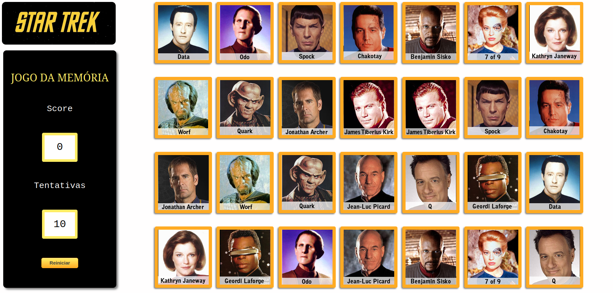

# JOGO DA MEMÓRIA EM JAVASCRIPT

## Atividade do desafio de projeto do bootcamp da DIO.

O jogo é com personagens da série STAR TREK da qual eu sou muito fã, tem 14 pares diferentes de cartas com o total de 28 cartas.

Antes de iniciar o projeto eu decidi quais seriam as funcionalidades do jogo conforme abaixo: 
 - Mostrar cartas no início para que o jogador tenha tempo de memorizar alguns pares.
 - Marcar o número de pontos do jogador
 - Número máximo de tentativas
 - Botão para reiniciar a partida

Desafio concluído com sucesso! Consegui implementar tudo que eu decidi previamente, e isso foi uma experiência fenomenal. A sensação de ver meu primeiro jogo funcionando é algo difícil de explicar. 

Foi muito legal colocar em prática o conteúdo aprendido no bootcamp, com certeza após esse projeto JavaScript virou minha paixão. 

Este projeto não tem fins lucrativos e serve apenas para uso pessoal como portifólio de projeto.
Todas as imagens foram retiradas da internet e os direitos autorais são da [Paramount Pictures Corporation](http://www.paramount.com/). 
